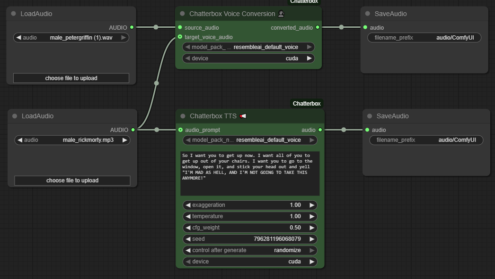

<!-- Improved compatibility of back to top link: See: https://github.com/othneildrew/Best-README-Template/pull/73 -->
<a id="readme-top"></a>

<!-- PROJECT LOGO -->
<br />
<div align="center">
  <a href="https://github.com/wildminder/ComfyUI-Chatterbox">
    
  </a>

  <h3 align="center">ComfyUI Chatterbox</h3>

  <p align="center">
    High-quality Text-to-Speech (TTS) and Voice Conversion (VC) nodes for ComfyUI, powered by Resemble AI's Chatterbox model.
    <br />
    <br />
    <a href="https://github.com/wildminder/ComfyUI-Chatterbox/issues/new?labels=bug&template=bug-report---.md">Report Bug</a>
    ·
    <a href="https://github.com/wildminder/ComfyUI-Chatterbox/issues/new?labels=enhancement&template=feature-request---.md">Request Feature</a>

<!-- PROJECT SHIELDS -->
[![Stargazers][stars-shield]][stars-url]
[![Issues][issues-shield]][issues-url]
[![Contributors][contributors-shield]][contributors-url]
[![Forks][forks-shield]][forks-url]
  </p>

</div>

<!-- TABLE OF CONTENTS -->
<details>
  <summary>Table of Contents</summary>
  <ol>
    <li>
      <a href="#about-the-project">About The Project</a>
      <ul>
        <li><a href="#major-update-notice">Major Update Notice</a></li>
        <li><a href="#features">Features</a></li>
      </ul>
    </li>
    <li>
      <a href="#getting-started">Getting Started</a>
      <ul>
        <li><a href="#installation">Installation</a></li>
      </ul>
    </li>
    <li><a href="#usage">Usage</a>
        <ul>
        <li><a href="#node-parameters-explained">Node Parameters Explained</a></li>
      </ul>
    </li>
    <li><a href="#roadmap">Roadmap</a></li>
    <li><a href="#contributing">Contributing</a></li>
    <li><a href="#acknowledgments">Acknowledgments</a></li>
  </ol>
</details>

<!-- ABOUT THE PROJECT -->
## About The Project

ComfyUI custom nodes for the powerful [Resemble AI Chatterbox](https://github.com/resemble-ai/chatterbox) library. It enables seamless in-workflow Text-to-Speech and Voice Conversion, complete with deep integration into ComfyUI's model management system for efficient VRAM usage.


<p align="right">(<a href="#readme-top">back to top</a>)</p>

### Major Update Notice

> [!NOTE]
> This version of ComfyUI-Chatterbox has been deeply refactored for better performance, stability, and alignment with ComfyUI codebase. Key improvements include:

<p align="right">(<a href="#readme-top">back to top</a>)</p>

### Features

*   **Chatterbox TTS Node:** Synthesize speech from text with optional voice cloning from an audio prompt.
*   **Chatterbox Voice Conversion Node:** Convert the voice in a source audio file to a target voice.
*   **Automatic Model Downloading:** Models are automatically downloaded from Hugging Face on first use.
*   **Efficient VRAM Management:** Full integration with ComfyUI's model patcher system to load models to GPU only when needed and offload them afterward.
*   **Detailed Generation Control:** Fine-tune your audio output with parameters for speed, expressiveness, creativity, and quality.
*   **Accurate Progress Bars:** Both console and UI progress bars reflect the true step-by-step generation process.

<p align="right">(<a href="#readme-top">back to top</a>)</p>

<!-- GETTING STARTED -->
## Getting Started

### Installation

1.  **Install via ComfyUI Manager (Recommended):**
    *   Search for `ComfyUI-Chatterbox` in the ComfyUI Manager and install it.

2.  **Manual Installation:**
    *   Clone this repository into your `ComfyUI/custom_nodes/` directory:
        ```bash
        git clone https://github.com/wildminder/ComfyUI-Chatterbox.git ComfyUI/custom_nodes/ComfyUI-Chatterbox
        ```

3.  **Install Dependencies:**
    *   Navigate to the new directory and install the required packages:
        ```bash
        cd ComfyUI/custom_nodes/ComfyUI-Chatterbox
        pip install -r requirements.txt
        ```

4.  **Model Management:**
    > [!IMPORTANT]
    > **For users of previous versions:** This update changes the model directory. You **must manually delete** your old model folder to avoid conflicts:
    >
    > **Delete this folder:** `ComfyUI/models/chatterbox_tts/`
    >
    > The new version will automatically download models to the correct ComfyUI-standard directory: `ComfyUI/models/tts/chatterbox/`.

5.  **Restart ComfyUI.**

<p align="right">(<a href="#readme-top">back to top</a>)</p>

<!-- USAGE EXAMPLES -->
## Usage

After installation, you will find two new nodes:
*   **Chatterbox TTS 📢** under the `audio/generation` category.
*   **Chatterbox Voice Conversion 🗣️** under the `audio/generation` category.

Load an example workflow from the `workflow-examples/` directory in this repository to get started.

### Node Parameters Explained

#### Chatterbox TTS 📢 Parameters
  
  *   **`max_new_tokens`**: Maximum number of audio tokens to generate. Acts as a failsafe against run-on generations. 25 tokens is approximately 1 second of audio. The model's hard limit is 4096 tokens (≈ 163 seconds).
  *   **`flow_cfg_scale`**: CFG scale for the mel spectrogram decoder. Higher values increase adherence to the text content and speaker timbre but may reduce naturalness.
  *   **`exaggeration`**: Controls the expressiveness and emotional intensity. Higher values lead to more exaggerated prosody.
  *   **`temperature`**: Controls the randomness of the *token sampling* process. Higher values produce more diverse and creative speech, while lower values are more deterministic.
  *   **`cfg_weight`**: Classifier-Free Guidance (CFG) weight for the *token sampling* process.
  *   **`repetition_penalty`**: Penalizes repeated tokens to discourage monotonous or repetitive speech. `1.0` means no penalty.
  *   **`min_p` / `top_p`**: Parameters for nucleus sampling, controlling the pool of tokens the model can choose from at each step.
  

#### Chatterbox Voice Conversion 🗣️ Parameters
  
  *   **`n_timesteps`**: Number of diffusion steps for the flow matching process. Higher values can improve quality but will take longer to generate.
  *   **`temperature`**: Controls the randomness of the initial noise for the diffusion process. `1.0` is standard. Lower values are more deterministic; higher values are more random.
  *   **`flow_cfg_scale`**: CFG scale for the mel spectrogram decoder. Higher values increase adherence to the target voice's timbre but may reduce the naturalness of the speech prosody.
  *   **`target_voice_audio`**: The audio file containing the target voice timbre. If not provided, the default voice from the selected model pack will be used.


<p align="right">(<a href="#readme-top">back to top</a>)</p>


<!-- ACKNOWLEDGMENTS -->
## Acknowledgments

*   This node would not be possible without the incredible [Chatterbox](https://github.com/resemble-ai/chatterbox) library by **Resemble AI**.
*   README template adapted from the [Best-README-Template](https://github.com/othneildrew/Best-README-Template).

<p align="right">(<a href="#readme-top">back to top</a>)</p>

<!-- MARKDOWN LINKS & IMAGES -->
[contributors-shield]: https://img.shields.io/github/contributors/wildminder/ComfyUI-Chatterbox.svg?style=for-the-badge
[contributors-url]: https://github.com/wildminder/ComfyUI-Chatterbox/graphs/contributors
[forks-shield]: https://img.shields.io/github/forks/wildminder/ComfyUI-Chatterbox.svg?style=for-the-badge
[forks-url]: https://github.com/wildminder/ComfyUI-Chatterbox/network/members
[stars-shield]: https://img.shields.io/github/stars/wildminder/ComfyUI-Chatterbox.svg?style=for-the-badge
[stars-url]: https://github.com/wildminder/ComfyUI-Chatterbox/stargazers
[issues-shield]: https://img.shields.io/github/issues/wildminder/ComfyUI-Chatterbox.svg?style=for-the-badge
[issues-url]: https://github.com/wildminder/ComfyUI-Chatterbox/issues